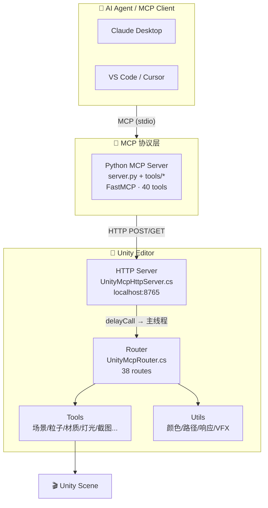
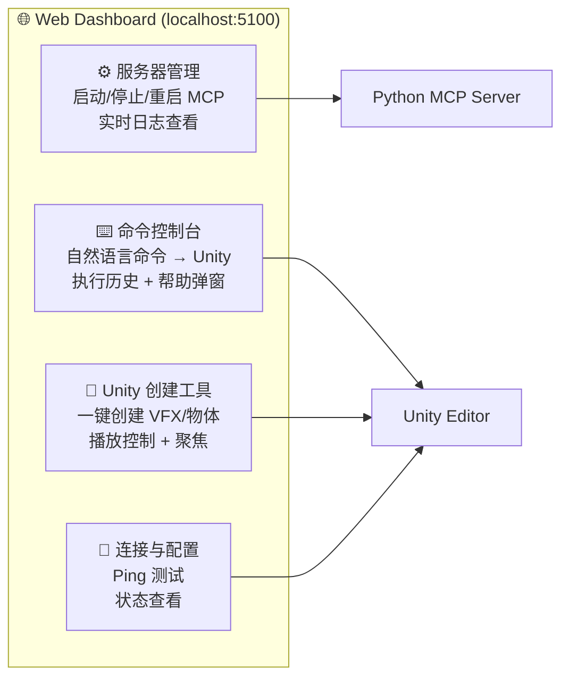

# 🎮 Unity MCP Server

> **让 AI 助手通过 MCP 协议直接操控 Unity Editor —— 创建场景、粒子特效、材质灯光、Prefab，一键调参、变体截图、报告导出**


[](https://github.com/cline/cline)
[](https://claude.ai/download)

---

## 📋 目录

- [1. 项目简介](#1-项目简介)
- [2. 系统架构](#2-系统架构)
- [3. 快速开始](#3-快速开始)
- [4. 目录结构](#4-目录结构)
- [5. 功能全景](#5-功能全景)
- [6. Web Dashboard 可视化管理](#6-web-dashboard-可视化管理)
- [7. 文本命令系统](#7-文本命令系统)
- [8. Unity Editor 仪表盘](#8-unity-editor-仪表盘)
- [9. MCP Client 配置](#9-mcp-client-配置)
- [10. MCP 工具参考](#10-mcp-工具参考)
- [11. HTTP API 参考](#11-http-api-参考)
- [12. Agent 工作流指南](#12-agent-工作流指南)
- [13. 扩展开发](#13-扩展开发)
- [14. 安全设计](#14-安全设计)
- [15. 常见问题排查](#15-常见问题排查)
- [16. 路线图](#16-路线图)

---

## 1. 项目简介

Unity MCP Server 由 **两大组件** 构成，通过 MCP 协议在 AI 与 Unity Editor 之间架起桥梁：

| 组件 | 语言 | 职责 |
|------|------|------|
| 🐍 **Python MCP Server** | Python | 实现 MCP 协议，暴露 40 个工具给 AI 客户端，通过 HTTP 转发请求到 Unity |
| 🎯 **Unity Editor 插件** | C# | 内嵌 HTTP 服务器，接收请求并调用 Unity API 操作场景、资源，**Editor 主线程安全执行** |

> **MCP（Model Context Protocol）** 是 Anthropic 推出的开放协议，让 AI 模型能够安全地发现和调用外部工具。

---

## 2. 系统架构



### 调用流程

```
AI Client → MCP Tool Call → Python Server → HTTP POST localhost:8765
    → Unity HttpListener (后台线程)
    → EditorApplication.delayCall (主线程)
    → 路由分发 → 工具执行 → JSON 响应返回
```

---

## 3. 快速开始

### 3.1 环境要求

| 依赖 | 要求 |
|------|------|
| 🐍 Python | >= 3.10 |
| 🎮 Unity | 2021 LTS ~ 2023 LTS |
| 🪟 操作系统 | Windows 10+ (HttpListener) |
| 📦 可选包 | URP（推荐）、Visual Effect Graph |

### 3.2 安装 Python 依赖

```powershell
cd D:\zm\YTT_TOOLs\mcp-server
python -m pip install -r requirements.txt
python -c "import mcp; import requests; print('✅ 依赖安装成功')"
```

### 3.3 安装 Unity 插件

```powershell
# 复制源码目录到你的 Unity 项目
Copy-Item -Recurse -Path "unity-plugin/Assets/Editor/UnityMCP" `
    -Destination "你的Unity项目\Assets\Editor\UnityMCP"
```

然后在 Unity Editor 中：

| 步骤 | 操作 |
|------|------|
| 1️⃣ | 等待脚本编译完成 |
| 2️⃣ | 菜单栏 → **Unity MCP → Start Server** |
| 3️⃣ | 或按 **F12** 通过仪表盘启动 |
| 4️⃣ | 确认控制台输出 `[UnityMCP] HTTP Server started at http://localhost:8765/` |

> 插件支持 `[InitializeOnLoad]` 随 Editor 启动自动运行。

### 3.4 启动 MCP Server

```powershell
cd D:\zm\YTT_TOOLs\mcp-server
python server.py
```

预期输出：
```
2025-06-06 10:00:00,000 - INFO - Running MCP server...
2025-06-06 10:00:00,000 - INFO - Registered 40 tools
```

---

## 4. 目录结构

```
📁 D:\zm\YTT_TOOLs\mcp-server/
│
├── 🚀 server.py                  # Python MCP Server 入口（FastMCP）
├── 📊 dashboard.py                # Web Dashboard 后端（Flask）
├── ⚙️ config.py                   # 配置（Unity URL、超时）
├── 📦 requirements.txt            # Python 依赖
├── .gitignore
│
├── 📂 tools/                      # Python MCP 工具模块
│   ├── __init__.py
│   ├── unity_http.py              # HTTP 请求封装（get/post_to_unity）
│   ├── connection_tools.py        # 连接测试
│   ├── scene_tools.py             # 场景操作
│   ├── vfx_tools.py               # VFX 创建（6 种特效）
│   ├── material_tools.py          # 材质系统
│   ├── prefab_tools.py            # Prefab 保存/实例化
│   ├── preview_tools.py           # 预览/播放/截图
│   ├── template_tools.py          # 模板生成
│   ├── asset_tools.py             # 资产管理
│   ├── tuning_tools.py            # 特效调优
│   ├── variant_tools.py           # 变体工具
│   ├── shader_tools.py            # Shader/VFX Graph
│   └── report_tools.py            # 报告导出
│
├── 📂 templates/
│   └── dashboard.html             # Web Dashboard 前端（深色主题）
│
├── 📂 unity-plugin/               # Unity 插件源码
│   └── Assets/Editor/UnityMCP/
│       ├── UnityMcpDashboard.cs   # 仪表盘 EditorWindow（F12 打开）
│       ├── UnityMcpHttpServer.cs  # HTTP 服务器（:8765）
│       ├── UnityMcpModels.cs      # 请求/响应模型
│       ├── UnityMcpRouter.cs      # 路由分发（36 POST + 2 GET）
│       ├── 📂 Tools/              # C# 工具实现
│       │   ├── UnityMcpConnectionTools.cs
│       │   ├── UnityMcpSceneTools.cs
│       │   ├── UnityMcpVfxTools.cs
│       │   ├── UnityMcpMaterialTools.cs
│       │   ├── UnityMcpPrefabTools.cs
│       │   ├── UnityMcpPreviewTools.cs
│       │   ├── UnityMcpTemplateTools.cs
│       │   ├── UnityMcpAssetTools.cs
│       │   ├── UnityMcpTuningTools.cs
│       │   ├── UnityMcpVariantTools.cs
│       │   ├── UnityMcpShaderTools.cs
│       │   └── UnityMcpReportTools.cs
│       └── 📂 Utils/
│           ├── UnityMcpColorUtils.cs       # HTML 颜色解析
│           ├── UnityMcpPathUtils.cs         # 安全路径校验
│           ├── UnityMcpResponseUtils.cs     # JSON 响应封装
│           └── UnityMcpVfxUtils.cs          # VFX 工具函数
│
├── 📂 docs/
│   ├── stage2-materials.md        # 材质系统详细文档
│   ├── stage3-advanced-vfx.md     # 高级 VFX 详细文档
│   └── stage4-preview-template-workflow.md  # 预览与工作流详细文档
│
├── 🧪 test-stage2.ps1             # 材质系统测试
├── 🧪 test-stage3.ps1             # 高级 VFX 测试
├── 🧪 test-stage4.ps1             # 预览与工作流测试
└── 🧪 test-stage5.ps1             # 调优/变体/Shader/报告测试
```

---

## 5. 功能全景

### 🎬 基础场景操作

| 能力 | 描述 |
|------|------|
| 创建空对象 | 在场景中创建空 GameObject |
| Transform 控制 | 设置位置/旋转/缩放 |
| 场景列举 | 查询当前场景所有物体 |
| 物体信息查询 | 获取物体的组件、材质、变换等详细信息 |

### ✨ 粒子 & VFX 特效

| 特效 | MCP 工具 | 描述 |
|------|----------|------|
| 🔥 **火焰爆炸** | `create_fire_explosion` | 火焰 + 烟雾 + 火花 + 闪光灯 |
| 🌀 **魔法传送门** | `create_magic_portal` | 环形粒子 + 核心 + 火花 + LineRenderer 光圈 + 灯光 |
| ⚡ **闪电打击** | `create_lightning_hit` | 锯齿闪电 + 分支 + 火花 + 光晕 |
| 💚 **治疗光环** | `create_heal_aura` | 地面光圈 + 上升粒子 + 闪烁粒子 + 灯光 |
| 💨 **烟雾爆发** | `create_smoke_burst` | 主烟 + 飘散 + 地面尘环 |
| ⚔️ **斩击拖尾** | `create_slash_trail` | 弧线 LineRenderer + 火花 + 灯光 |
| 🎨 **基础粒子** | `create_particle_effect` | 通用粒子系统创建 |

### 💡 灯光系统

| 能力 | 描述 |
|------|------|
| 创建点光源 | 设置颜色、强度、范围 |
| 参数调整 | 修改已有灯光的所有参数 |

### 🎨 材质系统

| 能力 | 描述 |
|------|------|
| 创建材质 | 指定颜色、Shader、自发光 |
| 分配材质 | 应用到任意场景物体 |
| 粒子材质 | 创建 Additive/透明粒子材质 |
| 颜色/自发光 | 修改已有材质属性 |
| Shader 属性 | 读写任意 Float/Color/Keyword 属性 |

### 🏗️ Prefab 系统

| 能力 | 描述 |
|------|------|
| 保存 Prefab | 场景物体 → Prefab 资产 |
| 实例化 Prefab | Prefab 资产 → 场景物体 |
| 模板系统 | 从模板 Prefab 生成新特效，自动复制材质 |

### 📸 预览 & 截图

| 能力 | 描述 |
|------|------|
| 场景聚焦 | 选中并 Frame 场景物体 |
| 播放/停止 | 控制粒子系统播放与停止 |
| 截图 | SceneView 或 GameView 截图保存为 PNG |

### 🎛️ 特效调优

| 能力 | 描述 |
|------|------|
| 粒子调参 | 时长、速率、生命周期、速度、大小、颜色 |
| 灯光调参 | 颜色、强度、范围 |
| LineRenderer 调参 | 颜色、宽度 |
| 整体重着色 | 同时修改粒子 + 灯光 + 渲染器 + LineRenderer |
| 整体缩放 | Transform + 粒子大小 + 粒子速度 |
| 时长调整 | 修改特效持续时间和播放速度 |

### 🧬 变体系统

| 能力 | 描述 |
|------|------|
| 批量克隆 | 生成多个变体并自动排列 |
| 批量截图 | 自动截图所有变体 |

### 📊 报告导出

| 能力 | 描述 |
|------|------|
| 特效报告 | 导出特效的组件、材质、变换信息为 JSON |

### 🎯 VFX Graph（可选）

| 能力 | 描述 |
|------|------|
| 属性读写 | 通过反射读取/设置 VisualEffect 暴露属性 |
| 模板创建 | 从 `.vfx` 模板创建 VFX Graph |

---

## 6. Web Dashboard 可视化管理

项目提供了一个基于 Flask 的 Web Dashboard，用于可视化管理 MCP Server 和直接操控 Unity。

### 启动

```powershell
cd D:\zm\YTT_TOOLs\mcp-server
pip install flask flask-cors
python dashboard.py
# 访问 http://localhost:5100
```

### 四大功能模块



### 架构

```
浏览器 (localhost:5100)
    │ REST API
dashboard.py (Flask)
    ├── 进程管理 → MCP Server (server.py)
    ├── Unity API 代理 → localhost:8765 → Unity Editor
    └── 命令解析引擎 → HTTP POST → Unity
```

---

## 7. 文本命令系统

Dashboard 内嵌了完整的文本命令解析引擎，无需记忆 API 端点和 JSON 格式。

### 语法格式

```
动作 类型 [参数...]
```

### 关键词参数

| 关键词 | 说明 | 示例 |
|--------|------|------|
| `named <name>` | 指定名称 | `named MySphere` |
| `at x y z` | 位置坐标 | `at 0 1 0` |
| `color #RRGGBB` | 十六进制颜色 | `color #FF4400` |
| `radius n` | 半径 | `radius 2.5` |
| `duration n` | 持续时间（秒） | `duration 3.0` |
| `intensity n` | 强度 | `intensity 1.2` |
| `loop true/false` | 是否循环 | `loop true` |
| `rate n` | 粒子发射速率 | `rate 100` |
| `speed n` | 粒子速度 | `speed 5` |
| `size n` | 粒子大小 | `size 0.3` |

### 命令类别速览

| 类别 | 命令 | 示例 |
|------|------|------|
| 🎬 **基础物体** | `create empty / light / cube / sphere / ...` | `create sphere named MySphere at 0 1 0 radius 0.5` |
| ✨ **粒子特效** | `create particle / fire / portal / lightning / ...` | `create fire named Blast radius 2.5 duration 1.5` |
| 🎨 **材质** | `create material` / `assign material` | `create material named MyMat color #FF5733` |
| 🎯 **物体操作** | `focus / play / stop / info / list / clear / move` | `move MyObject to 3 1 0` |
| 🎛️ **特效调优** | `recolor / scale / timing / update particle / ...` | `recolor MyEffect to #FF3366` |
| 🧬 **变体** | `variants / save prefab / capture / report` | `variants MyEffect count 3 spacing 3` |

### 执行流程

```
输入命令 → POST /api/unity-command → parse_command() 解析
    → 匹配端点 + 构造参数 → POST/GET Unity HTTP
    → 返回结果 → 展示在结果面板
    → 自动聚焦新创建物体
```

---

## 8. Unity Editor 仪表盘

Unity Editor 内置了一个 EditorWindow 仪表盘，无需外部 Web 服务即可查看和管理 MCP HTTP 服务器状态。

### 打开方式

| 方式 | 操作 |
|------|------|
| ⌨️ **快捷键** | 按 **F12** |
| 📋 **菜单栏** | **Unity MCP → Dashboard** |

### 功能卡片

| 卡片 | 功能 |
|------|------|
| 🟢 **服务器状态** | 运行状态指示灯 + 端口/地址信息 + 一键复制 |
| 🎮 **控制** | 启动 / 停止 / 重启 HTTP 服务器 |
| 📡 **连接检测** | 异步 Ping 测试 + 延迟毫秒数 |
| 📝 **活动日志** | 自动捕获 `[UnityMCP]` 日志，错误红色高亮 |

### 与 Web Dashboard 的关系

| 仪表盘 | 位置 | 用途 |
|--------|------|------|
| **Unity Editor 仪表盘** | Unity Editor 内部 (F12) | 快速查看状态、启停、Ping 测试 |
| **Web Dashboard** | 浏览器 (localhost:5100) | 进程管理、创建工具、命令控制台 |

两者互不冲突，可同时使用。

---

## 9. MCP Client 配置

### VS Code (Cline / Continue)

```json
{
  "mcpServers": {
    "unity-mcp-server": {
      "command": "python",
      "args": ["D:\\zm\\YTT_TOOLs\\mcp-server\\server.py"],
      "cwd": "D:\\zm\\YTT_TOOLs\\mcp-server"
    }
  }
}
```

### Claude Desktop

```json
{
  "mcpServers": {
    "unity-mcp-server": {
      "command": "python",
      "args": ["D:\\zm\\YTT_TOOLs\\mcp-server\\server.py"],
      "cwd": "D:\\zm\\YTT_TOOLs\\mcp-server"
    }
  }
}
```

### Cursor

在 Cursor 设置中添加 MCP Server，Command 指向 `python`，Args 指向 `server.py` 的完整路径。

---

## 10. MCP 工具参考

总计 **40 个 MCP 工具**，按模块分组：

| 模块 | 数量 | 🛠️ 工具列表 |
|------|:----:|-------------|
| 🔗 **connection** | 1 | `ping_unity` |
| 🎬 **scene** | 3 | `create_empty`, `list_scene_objects`, `set_transform` |
| ✨ **vfx** | 8 | `create_particle_effect`, `create_light`, `create_magic_portal`, `create_fire_explosion`, `create_lightning_hit`, `create_heal_aura`, `create_smoke_burst`, `create_slash_trail` |
| 🏗️ **prefab** | 1 | `save_prefab` |
| 🎨 **material** | 5 | `create_material`, `assign_material`, `create_additive_particle_material`, `set_material_color`, `set_material_emission` |
| 📸 **preview** | 4 | `focus_scene_object`, `play_effect`, `stop_effect`, `capture_view` |
| 📋 **template** | 2 | `create_vfx_from_template`, `instantiate_prefab` |
| 📦 **asset** | 3 | `list_generated_assets`, `clear_ai_generated_scene_objects`, `get_object_info` |
| 🎛️ **tuning** | 6 | `update_particle_system`, `update_light`, `update_line_renderer`, `recolor_effect`, `scale_effect`, `adjust_effect_timing` |
| 🧬 **variant** | 2 | `create_effect_variants`, `capture_effect_variants` |
| 🔬 **shader** | 4 | `list_material_properties`, `set_material_property`, `set_vfx_graph_property`, `create_vfx_graph_from_template` |
| 📊 **report** | 1 | `export_effect_report` |

---

## 11. HTTP API 参考

总计 **36 个 POST + 2 个 GET = 38 个 HTTP Endpoints**，监听于 `http://localhost:8765/`。

### GET 端点

| 路径 | 功能 |
|------|------|
| `/ping` | 连接测试，返回 `pong` |
| `/list-scene-objects` | 列举场景物体 |

### POST 端点（按模块）

<details>
<summary><b>📁 阶段一：基础场景</b>（点击展开）</summary>

| 路径 | 请求模型 |
|------|----------|
| `/create-empty` | `{name, x, y, z}` |
| `/set-transform` | `{objectName, x, y, z, rx, ry, rz, sx, sy, sz}` |
| `/create-particle-effect` | `{effectName, color, duration, emissionRate, startLifetime, startSpeed, startSize, radius, loop}` |
| `/create-light` | `{name, color, intensity, range, x, y, z}` |
| `/save-prefab` | `{objectName, prefabPath}` |

</details>

<details>
<summary><b>📁 阶段二：材质系统</b>（点击展开）</summary>

| 路径 | 请求模型 |
|------|----------|
| `/create-material` | `{materialName, color, shaderName, emissionColor, emissionIntensity}` |
| `/assign-material` | `{objectName, materialPath}` |
| `/create-additive-particle-material` | `{materialName, color, emissionIntensity}` |
| `/set-material-color` | `{materialPath, color}` |
| `/set-material-emission` | `{materialPath, emissionColor, emissionIntensity}` |

</details>

<details>
<summary><b>📁 阶段三：高级 VFX</b>（点击展开）</summary>

| 路径 | 请求模型 |
|------|----------|
| `/create-magic-portal` | `{effectName, mainColor, radius, duration, loop, saveAsPrefab}` |
| `/create-fire-explosion` | `{effectName, radius, intensity, duration, saveAsPrefab}` |
| `/create-lightning-hit` | `{effectName, mainColor, height, radius, duration, branchCount, saveAsPrefab}` |
| `/create-heal-aura` | `{effectName, mainColor, radius, duration, loop, density, saveAsPrefab}` |
| `/create-smoke-burst` | `{effectName, color, radius, duration, density, saveAsPrefab}` |
| `/create-slash-trail` | `{effectName, mainColor, length, width, duration, saveAsPrefab}` |

</details>

<details>
<summary><b>📁 阶段四：预览与工作流</b>（点击展开）</summary>

| 路径 | 请求模型 |
|------|----------|
| `/focus-scene-object` | `{objectName}` |
| `/play-effect` | `{objectName, includeChildren}` |
| `/stop-effect` | `{objectName, includeChildren, clearParticles}` |
| `/capture-view` | `{fileName, viewType, width, height}` |
| `/create-vfx-from-template` | `{templatePath, outputName, x, y, z, scale, mainColor, saveAsPrefab}` |
| `/instantiate-prefab` | `{prefabPath, objectName, x, y, z, scale}` |
| `/list-generated-assets` | `{assetType}` |
| `/clear-ai-generated-scene-objects` | `{prefix}` |
| `/get-object-info` | `{objectName, includeChildren}` |

</details>

<details>
<summary><b>📁 阶段五：调优与报告</b>（点击展开）</summary>

| 路径 | 请求模型 |
|------|----------|
| `/update-particle-system` | `{objectName, color, duration, emissionRate, startLifetime, startSpeed, startSize, loop}` |
| `/update-light` | `{objectName, color, intensity, range}` |
| `/update-line-renderer` | `{objectName, color, width, sx, sy}` |
| `/recolor-effect` | `{objectName, color, affectParticles, affectLights, affectRenderers, affectLines}` |
| `/scale-effect` | `{objectName, scaleMultiplier, scaleTransform, scaleParticleSize, scaleParticleSpeed, affectParticles}` |
| `/adjust-effect-timing` | `{objectName, duration, durationMultiplier, speedMultiplier}` |
| `/create-effect-variants` | `{sourceObjectName, count, spacing, variantPrefix}` |
| `/capture-effect-variants` | `{objectPrefix, filePrefix, viewType}` |
| `/list-material-properties` | `{objectName, materialPath}` |
| `/set-material-property` | `{objectName, materialPath, propertyName, propertyType, value}` |
| `/set-vfx-graph-property` | `{objectName, propertyName, propertyType, value}` |
| `/create-vfx-graph-from-template` | `{templatePath, outputName}` |
| `/export-effect-report` | `{objectName, fileName}` |

</details>

---

## 12. Agent 工作流指南

当 AI Agent 需要通过 Unity MCP Server 创建特效时，应按以下标准化流程操作。

### 标准流程

```
🔌 连接测试 → ✨ 创建特效 → ▶️ 播放聚焦 → 🎨 (调优/变体) → 📸 (截图/报告) → 🗑️ 清理
```

### 第一步：测试连接

```python
# 任何操作前必须先调用
ping_unity()
# 预期: {"success": true, "message": "pong"}
```

> **连接失败？** → 提示用户确认 Unity Editor 已启动，点击 **Unity MCP > Start Server**，检查端口 8765 是否被占用。

### 第二步：创建特效

**基础粒子效果：**
```
create_particle_effect(effect_name="MyEffect", color="#FF4400", duration=2.0,
                       emission_rate=80, start_lifetime=1.5, start_speed=2.0,
                       start_size=0.2, radius=1.0, loop=true)
```

**高级 VFX 特效：**

| 特效 | MCP 工具 | 关键参数 |
|------|----------|----------|
| 🔥 火焰爆炸 | `create_fire_explosion` | `effect_name, radius, intensity, duration` |
| 🌀 魔法传送门 | `create_magic_portal` | `effect_name, main_color, radius, loop` |
| ⚡ 闪电打击 | `create_lightning_hit` | `effect_name, main_color, height, branch_count` |
| 💚 治疗光环 | `create_heal_aura` | `effect_name, main_color, radius, loop` |
| 💨 烟雾爆发 | `create_smoke_burst` | `effect_name, color, radius, density` |
| ⚔️ 斩击拖尾 | `create_slash_trail` | `effect_name, main_color, length, width` |

**基础物体和灯光：**
```
create_empty(name="MyObject")        # 创建空物体
create_light(name="MyLight", ...)    # 创建点光源
create_material(name="MyMat", ...)   # 创建材质
```

### 第三步：播放和聚焦

```python
play_effect(object_name="MyEffect", include_children=true)
# → 播放特效及其所有子物体的粒子系统

focus_scene_object(object_name="MyEffect")
# → 在 SceneView 中聚焦并选中
```

> 使用 Dashboard 时，点击特效按钮会自动按顺序执行：**创建 → 播放 → 聚焦**

### 第四步：调优（可选）

```python
recolor_effect(object_name, color, ...)        # 整体重着色
scale_effect(object_name, scale, ...)          # 整体缩放
update_particle_system(object_name, ...)       # 调整粒子参数
adjust_effect_timing(object_name, ...)         # 调整时长/速度
```

### 第五步：截图/报告（可选）

```python
capture_view(file_name="Shot", view_type="scene", width=1920, height=1080)
export_effect_report(object_name="MyEffect", file_name="Report")
```

### 第六步：清理（可选）

```python
clear_ai_generated_scene_objects(prefix="MyEffect")
```

### 完整工作流示例

```powershell
# 1. 创建魔法传送门
$body = @{ effectName = "MyPortal"; mainColor = "#33AAFF"; radius = 2.0;
           duration = 5.0; loop = $true; saveAsPrefab = $true } | ConvertTo-Json
Invoke-RestMethod -Uri "http://localhost:8765/create-magic-portal" -Method Post `
    -Body $body -ContentType "application/json"

# 2. 播放并聚焦
Invoke-RestMethod -Uri "http://localhost:8765/play-effect" -Method Post `
    -Body (@{ objectName = "MyPortal"; includeChildren = $true } | ConvertTo-Json) `
    -ContentType "application/json"
Invoke-RestMethod -Uri "http://localhost:8765/focus-scene-object" -Method Post `
    -Body (@{ objectName = "MyPortal" } | ConvertTo-Json) -ContentType "application/json"

# 3. 截图
Invoke-RestMethod -Uri "http://localhost:8765/capture-view" -Method Post `
    -Body (@{ fileName = "MyPortal_Shot"; viewType = "scene"; width = 1920; height = 1080 } | ConvertTo-Json) `
    -ContentType "application/json"

# 4. 调参（重着色 + 缩放）
Invoke-RestMethod -Uri "http://localhost:8765/recolor-effect" -Method Post `
    -Body (@{ objectName = "MyPortal"; color = "#FF44AA"; affectParticles = $true;
              affectLights = $true; affectRenderers = $true; affectLines = $true } | ConvertTo-Json) `
    -ContentType "application/json"
Invoke-RestMethod -Uri "http://localhost:8765/scale-effect" -Method Post `
    -Body (@{ objectName = "MyPortal"; scaleMultiplier = 1.5; scaleTransform = $true;
              scaleParticleSize = $true; scaleParticleSpeed = $true; affectParticles = $true } | ConvertTo-Json) `
    -ContentType "application/json"

# 5. 批量变体 + 截图
Invoke-RestMethod -Uri "http://localhost:8765/create-effect-variants" -Method Post `
    -Body (@{ sourceObjectName = "MyPortal"; count = 4; spacing = 3.0; variantPrefix = "MyPortal" } | ConvertTo-Json) `
    -ContentType "application/json"

# 6. 导出报告
Invoke-RestMethod -Uri "http://localhost:8765/export-effect-report" -Method Post `
    -Body (@{ objectName = "MyPortal"; fileName = "MyPortal_Report" } | ConvertTo-Json) `
    -ContentType "application/json"

# 7. 清理
Invoke-RestMethod -Uri "http://localhost:8765/clear-ai-generated-scene-objects" -Method Post `
    -Body (@{ prefix = "MyPortal" } | ConvertTo-Json) -ContentType "application/json"
```

---

## 13. 扩展开发

### Python 端

```python
# 1. 创建 tools/my_new_tools.py
from tools.unity_http import post_to_unity

def register_my_tools(mcp):
    @mcp.tool()
    def my_new_tool(param1: str = "default", param2: float = 1.0) -> dict:
        """工具描述（将作为 MCP tool description 暴露给 AI 客户端）"""
        payload = {"param1": param1, "param2": param2}
        return post_to_unity("/my-new-endpoint", payload)

# 2. 在 server.py 中注册
from tools.my_new_tools import register_my_tools
register_my_tools(mcp)
```

### Unity C# 端

```csharp
// 1. 创建 Tools/UnityMcpMyNewTools.cs
using UnityEngine;
using UnityMCP.Utils;

namespace UnityMCP.Tools
{
    public static class UnityMcpMyNewTools
    {
        public static string MyNewAction(RequestModel req)
        {
            string param = req.someField;
            // 执行操作...
            return UnityMcpResponseUtils.Success("操作完成");
        }
    }
}

// 2. 在 UnityMcpRouter.cs 中添加路由
{ "/my-new-endpoint", (req) => UnityMcpMyNewTools.MyNewAction(req) }
```

### 测试

在测试脚本中添加步骤：
```powershell
Test-Step -Number N -Description "描述" -ScriptBlock {
    Invoke-RestMethod -Uri "$BaseUrl/my-new-endpoint" -Method Post `
        -Body ($body | ConvertTo-Json) -ContentType "application/json"
}
```

---

## 14. 安全设计

| 措施 | 说明 |
|------|------|
| 🛡️ **路径白名单** | 所有资产路径必须以 `Assets/` 开头，禁止 `..` 穿越 |
| 🔍 **路径分类校验** | 按类型细分校验（材质/截图/报告路径各有独立检查函数） |
| 🧹 **文件名消毒** | 移除 `\ / : * ? " < > \|` 等非法字符 |
| 📐 **参数 Clamp** | 所有数值参数经过 `Mathf.Clamp` 防止极端值 |
| 🚫 **禁止代码执行** | 不提供任何执行任意 C# 代码的工具 |
| 🔒 **仅限 localhost** | HTTP Listener 只绑定 `http://localhost:8765/`，不接受外部请求 |
| 📂 **资源隔离** | 所有生成资产限制在 `Assets/AI_Generated/` |
| 🔢 **自动编号** | 防止文件名冲突和覆盖已有资产 |

### 实现关键点

**线程安全：**
```
HttpListener (后台线程)
    → EditorApplication.delayCall (主线程队列)
    → Unity API 调用
    → 闭包传递响应回发送者
```

**Shader 兼容：**
- Shader 优先级回退：`URP → Built-in → Standard`
- 自动检测属性名：`_BaseColor` / `_Color` / `_EmissionColor`
- 兼容 URP / Built-in / HDRP 管线

**VFX Graph 可选性：**
- 通过 `Type.GetType()` 反射访问，不强制依赖
- 未安装 VFX Graph 包时返回友好提示
- 所有相关代码包裹在 try-catch 中

---

## 15. 常见问题排查

### 🔌 连接相关

| 问题 | 可能原因 | 解决方法 |
|------|----------|----------|
| `ping` 超时 | Unity 未启动 HTTP Server | 菜单栏 **Unity MCP > Start Server** 或 F12 仪表盘点击"启动" |
| 连接拒绝 | 端口 8765 被占用 | `netstat -ano \| findstr :8765` 查占用进程 |
| 返回空响应 | Unity 编译中 | 等待编译完成后再试 |
| 偶发线程异常 | Unity API 线程要求 | 所有请求已通过 delayCall 分发到主线程 |

### ✨ 特效相关

| 问题 | 可能原因 | 解决方法 |
|------|----------|----------|
| 粒子不显示 | 粒子材质不兼容渲染管线 | 安装 URP 包或创建 URP 兼容材质 |
| 自发光不亮 | Shader 不支持 `_EMISSION` | 使用 Standard 或 URP Lit Shader |
| LineRenderer 不显示 | 宽度太小或 Alpha=0 | 检查宽度（建议 0.02~0.3）和 Alpha > 0 |
| 截图全黑 | GameView 未渲染 | 使用 `viewType: "scene"` |
| VFX Graph 报错 | 未安装 VFX Graph 包 | 通过 Package Manager 安装 |

### 🧪 测试相关问题

| 问题 | 解决方法 |
|------|----------|
| `Invoke-RestMethod` 返回空 | 确保 Unity HTTP Server 已启动 |
| JSON 转义问题 | 使用 `ConvertTo-Json`，不要手动拼接 JSON |
| `curl.exe` 参数复杂 | 推荐使用 `Invoke-RestMethod` |
| 中文乱码 | 文件保存为 UTF-8 with BOM；建议使用 PowerShell 7+ |

---

## 16. 路线图

- [ ] 🏔️ **Terrains** —— 创建和编辑 Terrain
- [ ] 🎬 **Animations** —— 控制 Animation/Animator 组件
- [ ] 🔊 **Audio** —— 创建和播放 AudioSource
- [ ] 🖥️ **UI** —— 创建和操作 uGUI 元素
- [ ] 🎥 **Cinemachine** —— 控制虚拟相机
- [ ] ⏱️ **Timeline** —— 创建和控制 Timeline
- [ ] 📦 **ScriptableObject** —— 读取和编辑数据资产
- [ ] 🧭 **NavMesh** —— 寻路相关操作
- [ ] 📐 **GLTF/FBX 导入** —— 运行时导入外部模型
- [ ] 💾 **场景序列化** —— 保存和恢复场景状态

---

## 测试脚本说明

项目包含 4 个按阶段组织的 PowerShell 测试脚本：

| 脚本 | 测试内容 | 步骤数 |
|------|----------|:------:|
| `test-stage2.ps1` | 材质系统 | 10 |
| `test-stage3.ps1` | 高级 VFX | 8 |
| `test-stage4.ps1` | 预览与工作流 | 11 |
| `test-stage5.ps1` | 调优/变体/Shader/报告 | 16 |

统一执行模式：
```powershell
cd D:\zm\YTT_TOOLs\mcp-server
.\test-stage3.ps1  # 例如测试高级 VFX
```

所有测试脚本使用相同的函数模式（`Test-Step`），基于 `Invoke-RestMethod`（不要用 `curl.exe`）。

---

> **项目地址**：`D:\zm\YTT_TOOLs\mcp-server`  
> **Unity 插件源码**：`unity-plugin/Assets/Editor/UnityMCP/`
